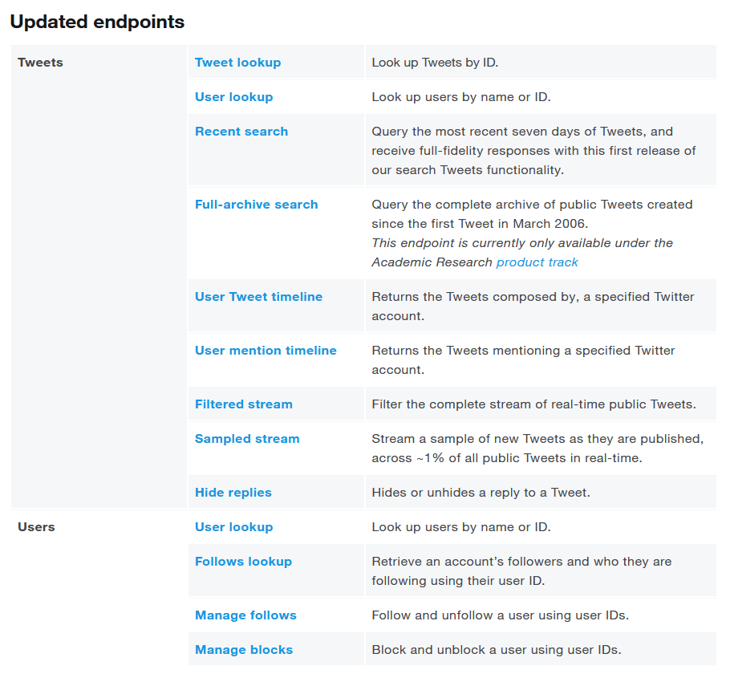
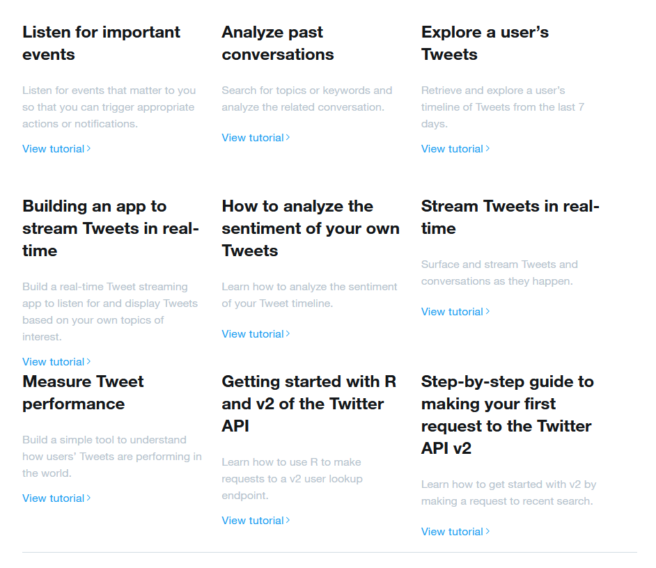

There are several API endpoints you can use, depending on what type of data you need to collect. The Twitter Developer platform provides detailed information about these endpoints, including how to connect to each of them, what data they provide, rate limits, example code, and even tutorials.

# API endpoints

Check <https://developer.twitter.com/en/docs/twitter-api/early-access> for info about API endpoints: 

```{r apiendpoints, fig.cap = "Twitter API endpoints"}

```

# Tutorials

Check <https://developer.twitter.com/en/docs/twitter-api/tutorials> for tutorials: 

```{r apitutorials, fig.cap = "Tutorials"}

```

There is also a tutorial on how to get started with R and v2 of the Twitter API: <https://developer.twitter.com/en/docs/tutorials/getting-started-with-r-and-v2-of-the-twitter-api>.

# How to use fields and expansions

Check: <https://developer.twitter.com/en/docs/twitter-api/data-dictionary/using-fields-and-expansions>.

## Fields

Check <https://developer.twitter.com/en/docs/twitter-api/fields>

## Expansions

Check <https://developer.twitter.com/en/docs/twitter-api/expansions> 

# HTTP status codes

Check: <https://developer.twitter.com/ja/docs/basics/response-codes>

# Examples and tests using Postman

Check: <https://documenter.getpostman.com/view/9956214/T1LMiT5U#450c778f-e50d-4021-8c00-27932eee469a>

Click "Run in Postman" and create an account to try out writing requests.

# How to build your queries

Check: <https://developer.twitter.com/en/docs/twitter-api/tweets/search/integrate/build-a-query>

# Location info

Check: <https://developer.twitter.com/en/docs/twitter-api/data-dictionary/object-model/place>

**Important:** Not all tweets have location info. If you have access to the academic track, then you should be able to build queries that filter on location info. For more details, check: <https://developer.twitter.com/en/docs/twitter-api/tweets/search/integrate/build-a-query>

# R-resources

You might need to refresh your tidyverse skills. So it's useful to check:

* <https://www.tidyverse.org/>
* <https://purrr.tidyverse.org/reference/index.html>
* <https://purrr.tidyverse.org/reference/map.html>
* <https://jennybc.github.io/purrr-tutorial/index.html>

The Twitter Dev materials mention the word "payload". Check: <https://en.wikipedia.org/wiki/Payload_(computing)> 

# Example reprex

reprex = minimal reproducible example

After reading <https://dev.to/twitterdev/understanding-the-new-tweet-payload-in-the-twitter-api-v2-1fg5> I was expecting that "text" will include the full text of all tweets returned by the API. However, I've noticed that's not the case for retweets. I then took these steps before posting the question on the Twitter developers forum:

1. create "test tweets" 
2. retrieve the "test tweets"
3. check if the retweets are truncated
4. wait 24 hours, check again the code and the results
5. post the code that reproduces the text truncation on GitHub
6. post the question on the developers forum

Link to the public repo where I've posted the minimal reproducible example: <https://github.com/anamartinovici/twitter_api_community>

Link to the post I've posted on the forum: <https://twittercommunity.com/t/tweet-text-truncated-to-140-characters/153383>

# References

Author name 1, Author name 2, (year), "Name of resource", journal/where it was published
